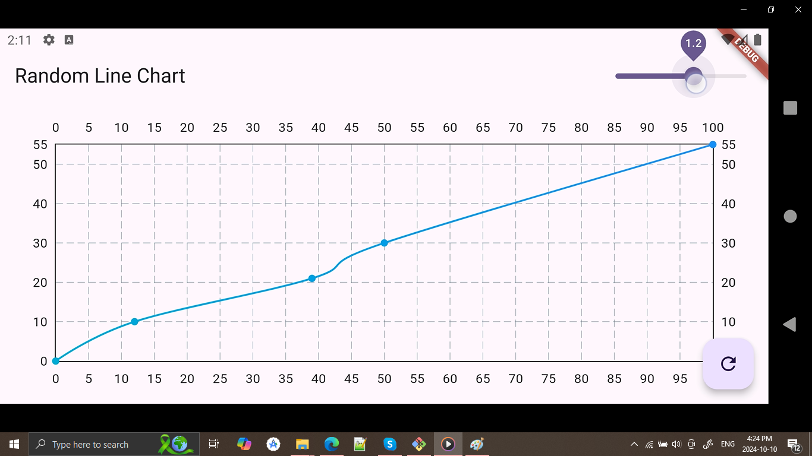
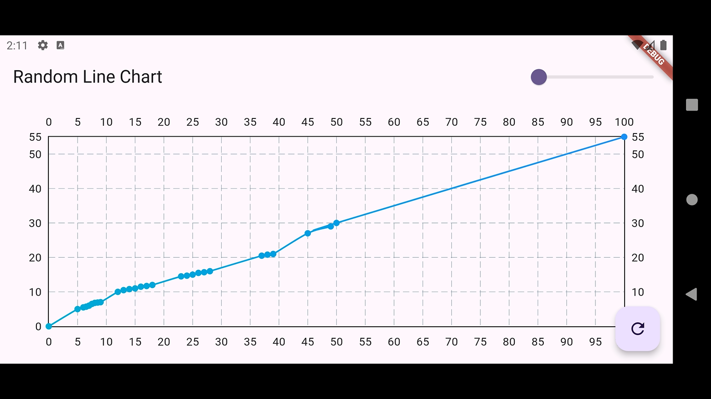

# RDP Algorithm Visualizer - Flutter App



## 📱 About

**RDP Algorithm Visualizer** is a Flutter application that demonstrates the Ramer-Douglas-Peucker (RDP) algorithm, a line simplification technique that reduces the number of points in a curve while preserving its shape. This app provides an intuitive, visual way to see how the algorithm works and its effects in real time.

## 🚀 Features

- **Interactive Visualization**: See the RDP algorithm simplifying a curve with adjustable tolerance.
- **Real-time adjustments**: Change the simplification threshold and see instant results.
- **Educational Interface**: Built to help users and developers understand the workings of the RDP algorithm.
- **Clean UI**: Designed with simplicity and user experience in mind.

## 🛠️ Technologies Used

- **Flutter**: Cross-platform framework for building the app.
- **Dart**: Programming language used for Flutter development.

## 📸 Screenshots

| Main Screen | Algorithm Visualized |
|-------------|----------------------|
|  |  |

## 🎥 YouTube Demo

Check out the demo of the RDP Algorithm Visualizer on YouTube: [Watch the Video](<https://www.youtube.com/watch?v=hnUzYspGlKM>)

## 🚀 Getting Started

### Prerequisites

Before running this project, you need the following installed:

- Flutter SDK: [Get Flutter](https://flutter.dev/docs/get-started/install)
- Android Studio or VSCode (IDE)

### Installation

1. Clone the repository:

    ```bash
    git clone https://github.com/mahesh1071997/Ramer_Douglas_Peucker.git
    ```

2. Navigate to the project folder:

    ```bash
    cd Ramer_Douglas_Peucker
    ```

3. Install dependencies:

    ```bash
    flutter pub get
    ```

4. Run the app:

    ```bash
    flutter run
    ```

## 🔧 Usage

1. Open the app on your device or emulator.
2. Draw or input points to create a curve.
3. Adjust the tolerance value to see the simplified curve in real time.
4. The app will show how the RDP algorithm reduces points while keeping the curve's shape.

## 🤝 Contributing

Contributions are welcome! Please follow the steps below to contribute:

1. Fork the project.
2. Create a new branch (`git checkout -b feature-branch`).
3. Make your changes and commit (`git commit -m 'Add new feature'`).
4. Push your changes (`git push origin feature-branch`).
5. Submit a pull request.


## 🙏 Acknowledgements

- Thanks to the Flutter community for resources and support.
- Open-source libraries used in this project.
